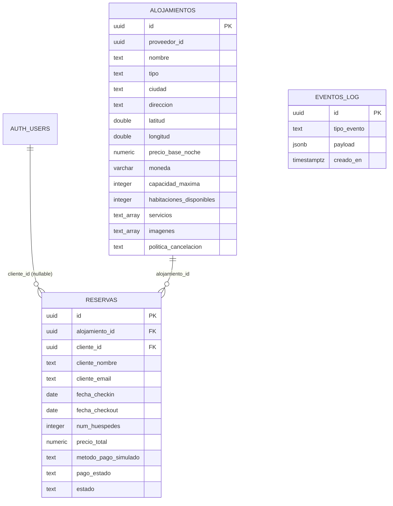

# Booking Prototipo - Integración de Sistemas

Prototipo de una plataforma de alojamientos tipo Booking, desarrollado como
proyecto integrador. Incluye un Marketplace público, un Panel de Administración,
una API REST en NestJS, persistencia PostgreSQL en Supabase, autenticación con
Supabase Auth y un registro de eventos de dominio para preparar la integración
EDA.

> **Estado de la evidencia de nube:** la configuración de Render y los enlaces
> públicos objetivo se incluyen en este repositorio. Sin embargo, al revisar
> `https://booking-alojamiento.onrender.com/marketplace/` y
> `https://booking-alojamiento.onrender.com/api/docs-json` el **7 de octubre de
> 2026**, ambos respondieron HTTP **503 Service Unavailable**. Por ello, este
> documento no afirma que el servicio esté 100 % activo ni que la base de datos
> de producción esté operativa en este momento. Se debe verificar el estado del
> servicio y volver a probar las URLs antes de entregar una afirmación de
> disponibilidad.

## 1. Resumen Ejecutivo y Estado del Despliegue

| Elemento                          | Implementación / estado                                                  |
| :-------------------------------- | :----------------------------------------------------------------------- |
| Aplicación                        | API NestJS y sitio estático HTML/CSS/JavaScript                          |
| Plataforma prevista               | Render Web Service, ejecutado con Docker                                 |
| Persistencia prevista             | Supabase PostgreSQL                                                      |
| Autenticación                     | Supabase Auth, JWT Bearer y roles `cliente` / `admin`                    |
| Marketplace                       | [`/marketplace/`](https://booking-alojamiento.onrender.com/marketplace/) |
| Panel Admin                       | [`/admin/`](https://booking-alojamiento.onrender.com/admin/)             |
| Swagger generado                  | [`/api/docs`](https://booking-alojamiento.onrender.com/api/docs)         |
| Resultado de verificación externa | HTTP 503 en Marketplace y Swagger JSON al 2026-10-07                     |

El repositorio contiene un [Dockerfile](./Dockerfile), un blueprint de Render
en [render.yaml](./render.yaml), configuración de variables de entorno y
scripts SQL para preparar Supabase. Esa configuración demuestra preparación
para despliegue, pero no prueba por sí sola que el servicio se encuentre
actualmente saludable, que esté conectado a una instancia de Supabase o que
los datos en producción estén disponibles.

**Condición habilitante de despliegue: pendiente de verificación/recuperación.**
Antes de marcarla como cumplida en una rúbrica, confirma en Render que el
servicio esté `Live`, revisa sus logs y ejecuta una prueba HTTP exitosa de las
tres URLs públicas. Comprueba además el acceso a Supabase desde la aplicación.

## 2. Matriz de Cumplimiento de Criterios de Evaluación

La matriz refleja el estado comprobable en el código y la verificación de nube
realizada; no convierte una función implementada localmente en una afirmación
de disponibilidad externa.

| Criterio de Evaluación                   |                  Estado                  | Evidencia Técnica / Ubicación                                                                                                                         |
| :--------------------------------------- | :--------------------------------------: | :---------------------------------------------------------------------------------------------------------------------------------------------------- |
| Despliegue en la nube                    |         **No verificable (503)**         | Blueprint y [Dockerfile](./Dockerfile); las URLs públicas consultadas devolvieron HTTP 503                                                            |
| Panel de Administración funcional        | **Cumple en código; nube no verificada** | [public/admin/](./public/admin/), `GET /api/v1/admin/eventos`, CRUD protegido por guards `admin`                                                      |
| Marketplace web funcional                | **Cumple en código; nube no verificada** | [public/](./public/), catálogo y filtros consumen `GET /api/v1/alojamientos`                                                                          |
| APIs implementadas y documentadas        |         **Cumple parcialmente**          | Controladores NestJS y Swagger generado en `/api/docs`; el documento runtime no es idéntico al contrato oficial                                       |
| Base de datos operativa (3FN)            | **Parcial; no se acredita 3FN estricta** | [database/schema.sql](./database/schema.sql) define `alojamientos`, `reservas`, `eventos_log`; no crea tabla `proveedores`, `servicios` ni `imagenes` |
| Diseño API-First y contratos             |               **Parcial**                | Hay DTOs, validación y contrato oficial en [contracts/](./contracts/); los recursos y rutas locales no coinciden estrictamente con el contrato GDS    |
| Endpoints para interoperabilidad         |     **Cumple en forma de respuesta**     | Mappers camelCase ↔ snake_case en `src/modules/*/entities/*mapper.ts`                                                                                 |
| Arquitectura EDA / Orientada a Eventos   |         **Parcial / prototipo**          | `ReservaRealizadaEvent` se inserta en `eventos_log`; no existe broker, Outbox ni atomicidad reserva-evento                                            |
| Documentación técnica                    |                **Cumple**                | Este README, esquemas ER, guía local y notas de despliegue                                                                                            |
| Dominio del código y decisiones técnicas |  **Documentado; requiere sustentación**  | NestJS modular, Supabase Auth/RLS, roles, DTOs y mapeadores explicados en este documento                                                              |

### Observaciones importantes para la evaluación

1. El archivo oficial [alojamientos-openapi.yaml](./contracts/alojamientos-openapi.yaml)
   describe **GDS Alojamientos Core API v1.0.0**: incluye rutas como `/search`
   y `/orders/create`, y no define el conjunto local
   `/api/v1/alojamientos` y `/api/v1/reservas` ni los modelos solicitados en
   este prototipo. NestJS toma del YAML el título, la descripción, la versión y
   las etiquetas para Swagger; genera sus rutas a partir de los controladores.
   Por tanto, **no se declara conformidad estricta** entre ambos contratos.
2. El esquema actual contiene tres tablas de dominio. `proveedor_id` es un UUID
   sin tabla `proveedores` ni clave foránea en el script actual.
3. `servicios` e `imagenes` son arreglos PostgreSQL `TEXT[]`, no JSONB ni tablas
   relacionales propias. Las coordenadas del alojamiento se almacenan en las
   columnas numéricas `latitud` y `longitud`; el payload de eventos sí es `JSONB`.
   Esta decisión del prototipo significa que no se debe presentar el esquema
   como normalizado estrictamente en 3FN.
4. El pago es una simulación local. No hay cobro real ni integración con
   pasarela de pagos.
5. La API guarda la reserva y luego escribe el evento en otra operación REST.
   Si falla la escritura del evento, la reserva podría ya existir.

## 3. Justificación Detallada por Criterio

### 3.1 Despliegue y Accesibilidad Pública

Enlaces públicos objetivo:

- Marketplace: <https://booking-alojamiento.onrender.com/marketplace/>
- Panel de Administración: <https://booking-alojamiento.onrender.com/admin/>
- Documentación Swagger: <https://booking-alojamiento.onrender.com/api/docs>

El servicio se configura como **Render Web Service con runtime Docker**. El
[Dockerfile](./Dockerfile) compila NestJS en una etapa de build y copia el
resultado, los recursos públicos y el contrato YAML a la imagen de runtime.
[render.yaml](./render.yaml) declara el servicio y usa `/api/docs` como health
check.

**Estado comprobado el 2026-10-07:** las solicitudes a Marketplace y
`/api/docs-json` devolvieron HTTP 503. Los enlaces son direcciones previstas,
no evidencia suficiente de que la aplicación esté operativa. Para completar
este criterio:

1. Revisa en Render el estado `Live`, los deploys y los logs de arranque.
2. Verifica que estén definidas las variables de entorno que exige el backend.
3. Comprueba que el SQL de esquema/migración se ejecutó en el proyecto Supabase
   que corresponde a esas variables.
4. Repite la validación de Marketplace, Panel y Swagger. No publiques
   credenciales de Supabase como evidencia.

Render inyecta `PORT`; localmente la aplicación usa 3000 por defecto.

### 3.2 Sistema de Administración

El Panel permite consultar alojamientos, crear, editar y eliminar registros,
consultar reservas y visualizar eventos. Sus recursos de interfaz están en
[public/admin/](./public/admin/). La página valida la sesión antes de mostrar
el contenido, muestra el botón **Modo Administración** solo tras validar una
sesión cuyo rol sea exactamente `admin`, y redirige al Marketplace a los
clientes que intenten abrir el Panel.

La protección efectiva no depende solo de la interfaz:

- `POST`, `PUT` y `DELETE /api/v1/alojamientos` requieren el rol `admin`.
- `GET /api/v1/admin/eventos` requiere `admin`.
- `GET /api/v1/reservas` requiere `admin`.
- `GET /api/v1/reservas/mis-reservas` requiere `cliente` y filtra por el ID del
  usuario autenticado.
- El rol se deriva del `app_metadata.role` retornado por Supabase Auth tras
  validar el Bearer token; un valor de `user_metadata` no concede privilegios.
- Las rutas protegidas responden 401 si falta o no sirve el token y 403 si el
  usuario autenticado no tiene el rol necesario.

#### Acceso administrativo de prueba

El repositorio incluye
[scripts/seed-admin.mjs](./scripts/seed-admin.mjs), que crea o actualiza el
usuario `admin@booking.ec`, confirma su correo y asigna
`app_metadata.role = admin`. **El usuario no se crea automáticamente por
documentar las credenciales.** Debe ejecutarse el script de forma explícita
con `SUPABASE_URL`, `SUPABASE_SERVICE_ROLE_KEY` y `ADMIN_SEED_PASSWORD`
configurados.

Para un entorno local aislado, asigna a `ADMIN_SEED_PASSWORD` la contraseña
temporal para pruebas solicitada por el equipo docente y ejecuta:

```powershell
npm run seed:admin
```

El valor de contraseña no se incorpora a código ni al README como secreto. El
script actualiza la contraseña cada vez que se ejecuta. **No uses la clave de
prueba en producción**; usa una contraseña única y cámbiala antes de publicar.

#### Carga de alojamientos de prueba

[scripts/seed-alojamientos.mjs](./scripts/seed-alojamientos.mjs) carga diez
alojamientos en Quito, Cuenca, Guayaquil, Baños de Agua Santa, Mindo,
Montañita y Puerto Ayora, con precios USD, coordenadas, servicios e imágenes.
Usa UUIDs estables y `upsert`, así que puede repetirse sin duplicar las
propiedades sembradas:

```powershell
npm run seed:alojamientos
```

Configura `SUPABASE_URL` y `SUPABASE_SERVICE_ROLE_KEY` en `.env` o en el entorno.
El script no se ejecuta automáticamente al iniciar el backend ni al desplegar.
Mantén la service-role key fuera del cliente y de Git.

#### Actividad de prueba sin crear usuarios de autenticación

[scripts/seed-usuarios.mjs](./scripts/seed-usuarios.mjs) crea o actualiza 30
reservas ficticias asociadas a alojamientos existentes. Usa correos bajo
`example.com` y deja `cliente_id` en `NULL`: no crea cuentas, contraseñas ni
identidades en Supabase Auth, y no permite que estos datos inicien sesión.
Requiere primero alojamientos y las variables `SUPABASE_URL` y
`SUPABASE_SERVICE_ROLE_KEY`:

```powershell
npm run seed:usuarios
```

El seed es repetible gracias a IDs fijos y `upsert`; las reservas de prueba se
mezclan con las de clientes en el panel administrativo, pero no aparecen en
**Mis reservas** de una cuenta real.

#### Normalización de listas de Supabase

`servicios` e `imagenes` se almacenan como `TEXT[]`. El mapper de alojamientos
responde siempre arreglos de strings: además de los arreglos nativos, acepta
valores serializados como JSON (`["WiFi"]`) y responde con error explícito si
el dato no se puede validar.

### 3.3 Marketplace Web

La interfaz estática se sirve desde [public/](./public/) bajo
`/marketplace/`. Permite:

- Consultar el catálogo desde `GET /api/v1/alojamientos`.
- Filtrar por `ciudad` y `precioMaximo`.
- Abrir la ficha del alojamiento, consultar descripción, capacidad, servicios,
  imágenes y política de cancelación.
- Calcular en el navegador un estimado por noches y enviar la reserva a
  `POST /api/v1/reservas`.
- Iniciar sesión o registrarse como cliente para reservar.
- Consultar el historial personal desde **Mis reservas**; el endpoint
  `GET /api/v1/reservas/mis-reservas` filtra las filas por el usuario asociado
  al JWT validado.

El backend vuelve a validar fechas, capacidad y disponibilidad, y calcula el
total a partir del precio guardado, en vez de confiar en el importe calculado
por el navegador. El resultado de pago es **simulado**; no se contacta ni se
cobra a una pasarela financiera.

Un cliente autenticado puede reservar varios alojamientos o fechas: no hay una
restricción de una sola reserva por usuario. Tras cada POST exitoso, el
Marketplace cierra y limpia el formulario, muestra **“¡Reserva realizada con
éxito!”** y permite continuar explorando o consultar el historial.

### 3.4 APIs y Documentación Swagger/OpenAPI

Swagger se publica en `/api/docs`. La aplicación carga en runtime los
metadatos `info` y `tags` del YAML oficial, y genera el documento operativo
desde los controladores y DTOs NestJS. Los métodos protegidos indican el
esquema Bearer `supabase-jwt`.

#### Endpoints del prototipo

| Método   | Ruta                            | Acceso                                    |
| :------- | :------------------------------ | :---------------------------------------- |
| `POST`   | `/api/v1/auth/register`         | Público; crea exclusivamente clientes     |
| `POST`   | `/api/v1/auth/login`            | Público                                   |
| `GET`    | `/api/v1/auth/me`               | JWT válido                                |
| `GET`    | `/api/v1/alojamientos`          | Público; filtros `ciudad`, `precioMaximo` |
| `GET`    | `/api/v1/alojamientos/:id`      | Público                                   |
| `POST`   | `/api/v1/alojamientos`          | Solo `admin`                              |
| `PUT`    | `/api/v1/alojamientos/:id`      | Solo `admin`                              |
| `DELETE` | `/api/v1/alojamientos/:id`      | Solo `admin`                              |
| `POST`   | `/api/v1/reservas`              | Solo `cliente` autenticado                |
| `GET`    | `/api/v1/reservas/mis-reservas` | Solo `cliente`; filtra por su JWT         |
| `GET`    | `/api/v1/reservas`              | Solo `admin`                              |
| `GET`    | `/api/v1/admin/eventos`         | Solo `admin`                              |

#### Contrato de la materia frente a la API implementada

Se preserva sin modificaciones el archivo
[contracts/alojamientos-openapi.yaml](./contracts/alojamientos-openapi.yaml).
Este contrato oficial define el dominio GDS, con operaciones como búsqueda,
disponibilidad y órdenes; no contiene las rutas locales anteriores ni los
modelos de alojamiento/reserva usados por esta aplicación. El documento
Swagger runtime describe la API NestJS y reutiliza metadatos del YAML, pero no
es una implementación exacta de todas sus operaciones.

La alineación estricta requiere una decisión del curso/equipo: actualizar el
API local al contrato GDS sin romper el producto, o acordar y versionar un
contrato complementario para el prototipo. Este README no declara equivalencia
que no está presente en el código.

### 3.5 Base de Datos Supabase y Normalización

El esquema nuevo está en [database/schema.sql](./database/schema.sql). Para
una base que ya tenía la estructura anterior se proporcionan
[20261007_contract_alignment.sql](./database/migrations/20261007_contract_alignment.sql)
y
[20261008_auth_and_rls.sql](./database/migrations/20261008_auth_and_rls.sql).
Los scripts deben ejecutarse en Supabase con una cuenta autorizada.



Entidades de la aplicación:

- **Alojamientos:** catálogo, proveedor identificado por un UUID externo y
  valores de ubicación/precio/capacidad.
- **Reservas:** referencia obligatoria al alojamiento y referencia nullable
  al usuario de `auth.users`; conserva datos del huésped y del precio al
  momento de reservar.
- **EventosLog:** registro JSONB de eventos del dominio; no tiene FK a la
  reserva para admitir eventos de integración de distintos dominios.

**Nota de normalización:** no hay tabla `proveedores` en este esquema y
`proveedor_id` no declara FK. `servicios` e `imagenes` son columnas PostgreSQL
`TEXT[]`; `alojamientos.latitud` y `alojamientos.longitud` son columnas numéricas
y `eventos_log.payload` es JSONB. Por lo tanto, el esquema no demuestra
normalización estricta en 3FN. Para afirmar
3FN, una iteración deberá crear entidades/tablas de proveedores, servicios e
imágenes con relaciones y migrar los datos, manteniendo aparte el snapshot
transaccional que se requiera en una reserva.

El script aplica RLS a las tablas públicas: el catálogo es legible, pero las
escrituras directas de `anon`/`authenticated` y el acceso directo a reservas y
eventos se revocan. El servidor usa la clave service-role para acceder a datos
solo después de autorizar la petición con NestJS. La clave service-role elude
RLS y nunca debe enviarse al navegador.

### 3.6 Diseño API-First e Interoperabilidad

Los controladores y DTOs dan forma explícita a los cuerpos HTTP y aplican
validación con `class-validator`, `class-transformer` y `ValidationPipe`.
Los mappers convierten la nomenclatura de PostgreSQL a la respuesta camelCase
del API:

```text
precio_base_noche  <->  precioBaseNoche
alojamiento_id     <->  alojamientoId
fecha_checkin      <->  fechaCheckin
```

La correspondencia es explícita en
`src/modules/accommodations/entities/alojamiento.mapper.ts` y
`src/modules/reservations/entities/reserva.mapper.ts`. Los DTOs conservan
campos como `proveedorId`, `nombre`, `coordenadas`, `precioBaseNoche`,
`clienteNombre`, `fechaCheckin` y `metodoPagoSimulado`. La interoperabilidad
camelCase de las respuestas sí está implementada; no implica conformidad con
los paths o esquemas del YAML oficial que son distintos.

### 3.7 Arquitectura SOA/EDA y Eventos

Al crear una reserva, el servicio calcula el precio, inserta la reserva con
estado de pago simulado `exitoso` y estado `confirmada`, y después inserta un
evento `ReservaRealizadaEvent` en `eventos_log`. El payload contiene
`eventId`, `eventType`, `occurredAt` y datos de la reserva. El Panel Admin
consulta ese registro para monitorear el flujo.

El estado actual es una **preparación EDA**, no un bus de eventos. Las dos
escrituras a Supabase no son una transacción atómica; si la segunda falla, la
reserva puede persistir sin evento. Para robustecerlo en una siguiente fase:

1. Insertar reserva y Outbox dentro de una transacción PostgreSQL.
2. Publicar Outbox en RabbitMQ, Kafka, Pub/Sub u otro broker mediante un
   dispatcher con reintentos.
3. Definir contrato versionado (por ejemplo, AsyncAPI/JSON Schema), claves de
   idempotencia, correlación y trazabilidad.
4. Crear consumidores desacoplados de notificaciones, facturación y analítica,
   con dead-letter queue y métricas.

### 3.8 Estructura del Proyecto y Decisiones Arquitecturales

```text
.
├── contracts/
│   └── alojamientos-openapi.yaml   # contrato oficial, sin cambios
├── database/
│   ├── schema.sql                 # esquema inicial, políticas y semillas
│   └── migrations/                # evolución del modelo y seguridad
├── public/
│   ├── index.html, app.js, ...    # Marketplace
│   ├── auth-client.js
│   ├── login/                     # acceso y registro
│   └── admin/                     # Panel Admin
├── scripts/
│   ├── seed-admin.mjs              # alta/actualización admin explícita
│   ├── seed-alojamientos.mjs       # alojamientos de prueba
│   └── seed-usuarios.mjs           # reservas con clientes ficticios
└── src/
    ├── modules/
    │   ├── accommodations/        # catálogo CRUD, DTOs y mappers
    │   ├── reservations/          # reservas y evento de dominio
    │   ├── admin/                 # consulta de eventos
    │   └── auth/                  # Supabase Auth y guards de roles
    ├── supabase/                  # clientes Supabase de servidor/Auth
    ├── app.module.ts
    └── main.ts                    # CORS, validación y Swagger
```

Decisiones:

- **NestJS:** módulos, inyección de dependencias, DTOs, validación y guards
  hacen explícita la separación entre catálogo, reservas, administración y
  autenticación.
- **Supabase:** aporta PostgreSQL administrado y Supabase Auth; sus claves
  pública y service-role se separan, y RLS constituye defensa adicional para
  el acceso directo a las tablas.
- **Render:** aloja el contenedor Docker mediante un Web Service y permite
  configurar secretos de ejecución sin incorporarlos a la imagen.
- **HTML/CSS/JavaScript:** Marketplace y Panel estáticos servidos desde NestJS
  en el mismo origen, evitando una capa adicional de hosting frontend en el
  prototipo.

## 4. Instalación y Ejecución Local

### Requisitos

- Node.js 22 o compatible con el comando `node --env-file-if-exists`.
- npm.
- Proyecto Supabase con Auth y PostgreSQL habilitados.
- Docker es necesario solo para construir/ejecutar la imagen.

### Variables de entorno

Copia [.env.example](./.env.example) a `.env` y completa los secretos localmente:

```env
SUPABASE_URL=https://your-project.supabase.co
SUPABASE_KEY=your-anon-or-publishable-key
SUPABASE_SERVICE_ROLE_KEY=your-private-service-role-key
ADMIN_SEED_PASSWORD=una-clave-local-segura-de-al-menos-12-caracteres
PORT=3000
```

No agregues `.env` al repositorio. `SUPABASE_KEY` es para los flujos de Auth;
`SUPABASE_SERVICE_ROLE_KEY` solo se usa por el servidor y script de seeding.

### Preparar base y arrancar

1. Para proyecto nuevo, ejecuta [database/schema.sql](./database/schema.sql)
   en el SQL Editor de Supabase.
2. Para una base previa, ejecuta primero
   `database/migrations/20261007_contract_alignment.sql` y después
   `database/migrations/20261008_auth_and_rls.sql`.
3. Instala y compila:

   ```powershell
   npm install
   npm run build
   ```

4. Inicia en desarrollo:

   ```powershell
   npm run start:dev
   ```

5. Si necesitas el usuario de demostración, configura `ADMIN_SEED_PASSWORD`
   localmente y ejecuta `npm run seed:admin`.

Rutas locales con `PORT=3000`:

- Marketplace: <http://localhost:3000/marketplace/>
- Login/registro: <http://localhost:3000/login/>
- Panel Admin: <http://localhost:3000/admin/>
- Swagger: <http://localhost:3000/api/docs>

Comandos de calidad:

```powershell
npm test -- --runInBand
npm run build
npm run lint
```

## 5. Despliegue en Render

El Blueprint propone un Web Service Docker y requiere definir secretos en
**Dashboard → Environment**:

| Variable                    | Uso                                                        |
| :-------------------------- | :--------------------------------------------------------- |
| `SUPABASE_URL`              | URL del proyecto Supabase                                  |
| `SUPABASE_KEY`              | Clave anon/publishable para Auth                           |
| `SUPABASE_SERVICE_ROLE_KEY` | Acceso privado del backend a PostgreSQL/Auth Admin         |
| `PORT`                      | Render la inyecta para el servicio; localmente se usa 3000 |

La clave service-role puede saltarse RLS: limita su uso al backend, no la
incluyas en Docker build args, código cliente o commits. Ejecuta el seeding
administrativo fuera del navegador, con secretos, como proceso local u
operación one-off. Las variables `SUPABASE_URL` y claves son necesarias para
que NestJS inicie; si faltan o no corresponden, el servicio no podrá operar.

Después del deploy verifica, como mínimo:

```text
GET https://booking-alojamiento.onrender.com/api/docs
GET https://booking-alojamiento.onrender.com/marketplace/
GET https://booking-alojamiento.onrender.com/admin/
```

La página `/admin/` redirige a login sin una sesión admin; un HTTP 200 del HTML
no prueba por sí solo que la autorización ni Supabase funcionen. Prueba además
login, `/api/v1/auth/me`, lectura del catálogo y acceso denegado para una
cuenta cliente. Registra la fecha y el resultado real de esas pruebas antes de
afirmar que el despliegue está operativo.

## 6. Alcance, Limitaciones y Próximos Pasos

- Recuperar/verificar el servicio Render y probar la conexión a Supabase en la
  URL pública.
- Resolver con la materia la discrepancia entre el YAML GDS oficial y las
  rutas/modelos locales, manteniendo el archivo oficial intacto hasta tener
  aprobación para un contrato complementario.
- Normalizar proveedores, servicios e imágenes si 3FN es un criterio
  obligatorio.
- Añadir Outbox transaccional y broker para entrega confiable de eventos.
- Integrar una pasarela de pago real solo con un contrato de pagos aprobado;
  hoy el pago es simulado.
- Definir política operacional de rotación de secretos, respaldo, logs,
  monitoreo, límites de tasa y autenticación de producción.
