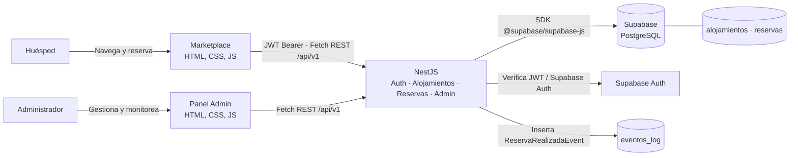
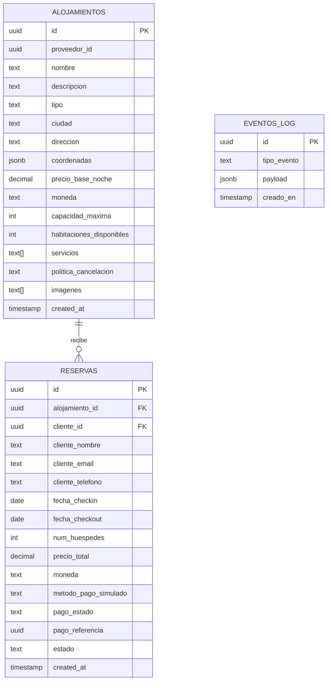

<p align="center">
  <a href="http://nestjs.com/" target="blank"></a>
</p>

[circleci-image]: https://img.shields.io/circleci/build/github/nestjs/nest/master?token=abc123def456
[circleci-url]: https://circleci.com/gh/nestjs/nest

  <p align="center">A progressive <a href="http://nodejs.org" target="_blank">Node.js</a> framework for building efficient and scalable server-side applications.</p>
    <p align="center">
<a href="https://www.npmjs.com/~nestjscore" target="_blank"></a>
<a href="https://www.npmjs.com/~nestjscore" target="_blank"></a>
<a href="https://www.npmjs.com/~nestjscore" target="_blank"></a>
<a href="https://circleci.com/gh/nestjs/nest" target="_blank"></a>
<a href="https://discord.gg/G7Qnnhy" target="_blank"></a>
<a href="https://opencollective.com/nest#backer" target="_blank"></a>
<a href="https://opencollective.com/nest#sponsor" target="_blank"></a>
  <a href="https://paypal.me/kamilmysliwiec" target="_blank"></a>
    <a href="https://opencollective.com/nest#sponsor"  target="_blank"></a>
  <a href="https://twitter.com/nestframework" target="_blank"></a>
</p>
  <!--[](https://opencollective.com/nest#backer)
  [](https://opencollective.com/nest#sponsor)-->

## Booking Alojamiento

Prototipo de plataforma de reservas con API en NestJS, persistencia en Supabase
y dos interfaces web responsivas: Marketplace público y Panel de Administración.

### Arquitectura inicial



- `src/modules/accommodations`: CRUD REST de alojamientos.
- `src/modules/reservations`: creación y consulta de reservas y registro del
  evento `ReservaRealizadaEvent`.
- `src/modules/admin`: consulta de eventos para monitoreo EDA.
- `src/supabase`: proveedor compartido del SDK oficial de Supabase.
- `public/` y `public/admin/`: interfaces servidas por NestJS desde el mismo
  origen que la API.

### Modelo de datos de Supabase

El esquema SQL completo y las semillas están en
[`database/schema.sql`](./database/schema.sql). Ejecútalo en el SQL Editor de
Supabase antes de iniciar el servicio. Si ya aplicaste el esquema anterior,
ejecuta primero
[`database/migrations/20261007_contract_alignment.sql`](./database/migrations/20261007_contract_alignment.sql).



`eventos_log.payload` guarda el contenido del evento como JSONB; se deja sin
clave foránea intencionalmente para poder registrar eventos de diferentes
dominios e integraciones.

### Ejecución local

Configura las variables en `.env` (puedes partir de `.env.example`; nunca
incluyas claves reales en Git):

```env
SUPABASE_URL=https://your-project.supabase.co
SUPABASE_KEY=your-supabase-anon-or-publishable-key
SUPABASE_SERVICE_ROLE_KEY=your-private-supabase-service-role-key
ADMIN_SEED_PASSWORD=replace-with-a-unique-password-of-at-least-12-characters
PORT=3000
```

Instala dependencias y ejecuta `npm install`, luego inicia con
`npm run start:dev`. Las rutas locales son:

- Swagger: `http://localhost:3000/api/docs`
- Marketplace: `http://localhost:3000/marketplace/`
- Login/registro: `http://localhost:3000/login/`
- Panel Admin: `http://localhost:3000/admin/`

#### Autenticación y roles

- `POST /api/v1/auth/register` crea únicamente cuentas `cliente`; el cuerpo no
  acepta ningún campo de rol.
- `POST /api/v1/auth/login` devuelve un JWT de Supabase Auth y el rol del
  usuario. El navegador conserva el access token en `sessionStorage`.
- `GET /api/v1/auth/me` valida el token Bearer y devuelve el perfil autenticado.
- El rol se lee exclusivamente de `app_metadata.role` (administrado por el
  servidor), nunca de `user_metadata` ni de valores enviados por el cliente.
- La creación de reservas requiere un usuario `cliente`; el `cliente_id` se
  toma del JWT verificado y no se acepta desde el cuerpo.
- La consulta de reservas, `/api/v1/admin/*` y las escrituras CRUD de
  alojamientos requieren `admin`. El catálogo `GET /api/v1/alojamientos`
  permanece público.
- Las políticas RLS dejan el catálogo en lectura pública y bloquean el acceso
  directo de `anon`/`authenticated` a reservas, eventos y escrituras; NestJS
  usa `SUPABASE_SERVICE_ROLE_KEY` únicamente en el servidor. Nunca se debe
  publicar esa clave en HTML, JavaScript, Git ni variables `VITE_*`.

Para crear o actualizar el administrador local, configura en `.env` la clave
de servicio privada y `ADMIN_SEED_PASSWORD`. Para el usuario de prueba
solicitado usa `admin@booking.ec` y guarda la contraseña temporal indicada
para pruebas en `ADMIN_SEED_PASSWORD`, solo en un entorno de desarrollo
aislado. El script fija `app_metadata.role` como `admin`, confirma el correo y
reinicia la contraseña al ejecutarse:

```powershell
npm run seed:admin
```

No se incluye esa contraseña en código ni en archivos versionados. Cámbiala
antes de publicar; nunca uses la contraseña de prueba en producción. Protege la
clave service-role con los secretos del entorno y rota cualquier clave que
haya sido expuesta.

La API devuelve claves camelCase y mapea las columnas snake_case de PostgreSQL.
Usa `GET/POST /api/v1/alojamientos`, `GET/PUT/DELETE
/api/v1/alojamientos/:id`, `GET/POST /api/v1/reservas` y
`GET /api/v1/admin/eventos`. Para alojamientos, el filtro de catálogo es
`ciudad` y `precioMaximo`.

El endpoint POST de reservas calcula `precioTotal` por noches, simula un pago
exitoso (sin cobrar dinero), guarda la reserva con `pagoEstado: "exitoso"` y
`estado: "confirmada"`, y escribe `ReservaRealizadaEvent` en `eventos_log`.

Swagger importa el título, la descripción y la versión desde
[`contracts/alojamientos-openapi.yaml`](./contracts/alojamientos-openapi.yaml).
**Compatibilidad del contrato:** el YAML oficial describe la API GDS con rutas
como `/search` y `/orders/create`, esquemas de reserva distintos y establece
que los pagos pertenecen a otro dominio. No contiene las entidades camelCase
indicadas para este prototipo. Por ello, las rutas `/api/v1/alojamientos` y
`/api/v1/reservas` conservan los campos solicitados y Swagger importa los
metadatos oficiales; el pago es una simulación local, no una integración
financiera ni compatibilidad completa con las operaciones GDS. Para conformidad
completa habría que acordar y añadir un contrato OpenAPI complementario para
este API.

### Despliegue en Render

El repositorio incluye un [`Dockerfile`](./Dockerfile) multi-stage y
[`render.yaml`](./render.yaml) para crear un servicio Docker. Para desplegar:

1. Sube este repositorio a GitHub y confirma que contiene `Dockerfile`,
   `.dockerignore` y `render.yaml`.
2. En Render, selecciona **New + → Blueprint**, conecta el repositorio y
   confirma la creación del servicio `booking-alojamiento`.
3. En **Dashboard → servicio → Environment**, configura
   `SUPABASE_URL`, `SUPABASE_KEY` y `SUPABASE_SERVICE_ROLE_KEY` usando las claves
   del proyecto Supabase. La service-role key es un secreto privado del
   backend; no la compartas con el navegador.
   `render.yaml` las declara como secretos no sincronizados (`sync: false`),
   por lo que Render solicitará sus valores.
4. Ejecuta [`database/schema.sql`](./database/schema.sql) en el SQL Editor de
   Supabase para una base nueva. En una instalación existente, aplica también
   [`database/migrations/20261008_auth_and_rls.sql`](./database/migrations/20261008_auth_and_rls.sql)
   después de la migración de alineación. Espera a que el despliegue indique
   **Live**, ejecuta el sembrado admin como proceso local/one-off con los
   secretos configurados y verifica el inicio de sesión.

Render inyecta `PORT` automáticamente; la aplicación escucha en
`process.env.PORT` y, si no se define, usa `3000` para desarrollo local. No es
necesario fijar `PORT` en `render.yaml`. Para ejecutar la imagen localmente,
puedes establecer `PORT=10000` o mapear el puerto del contenedor:

```powershell
docker build -t booking-alojamiento .
docker run --rm -p 3000:10000 `
  -e PORT=10000 `
  -e SUPABASE_URL=https://your-project.supabase.co `
  -e SUPABASE_KEY=your-supabase-anon-or-publishable-key `
  -e SUPABASE_SERVICE_ROLE_KEY=your-private-supabase-service-role-key `
  booking-alojamiento
```

No pases secretos durante `docker build`, no los escribas en el Dockerfile ni
los incluyas en el repositorio. Usa variables **Environment** secretas del
servicio Render. `SUPABASE_KEY` es la clave anon/publishable para Auth;
`SUPABASE_SERVICE_ROLE_KEY` solo se configura como secreto backend para acceder
a datos detrás de los guards de NestJS.

#### Enlaces públicos

El Blueprint propone el dominio `booking-alojamiento.onrender.com`. Una vez
desplegado, Render puede asignar o permitir cambiar el hostname; reemplaza el
dominio de ejemplo por el que figure en **Settings → Domains**:

- Swagger: [https://booking-alojamiento.onrender.com/api/docs](https://booking-alojamiento.onrender.com/api/docs)
- Marketplace: [https://booking-alojamiento.onrender.com/marketplace/](https://booking-alojamiento.onrender.com/marketplace/)
- Panel Admin: [https://booking-alojamiento.onrender.com/admin/](https://booking-alojamiento.onrender.com/admin/)

Los enlaces anteriores quedan activos únicamente después del despliegue exitoso.

> **Operación segura:** la service-role key elude RLS y, por ello, solo debe
> existir en el backend. RLS protege el acceso directo de los clientes; los
> guards de NestJS protegen los endpoints del API. Mantén ambas capas y usa una
> contraseña admin única, fuerte y rotada en producción.

### Próximas integraciones SOA/EDA (Reto 2)

1. **Publicación fiable:** guardar la reserva y un registro Outbox en una única
   transacción PostgreSQL; el proceso actual hace dos llamadas REST separadas,
   por lo que una reserva puede guardarse aunque falle la escritura del evento.
2. **Broker y desacoplamiento:** publicar el Outbox en RabbitMQ, Google Pub/Sub,
   AWS SNS/SQS o Kafka mediante un dispatcher; no acoplar el request HTTP al
   consumidor.
3. **Consumidores por dominio:** agregar servicios suscriptores para
   notificaciones, facturación y analítica, independientes del módulo de
   reservas.
4. **Contratos evolutivos:** definir JSON Schema/AsyncAPI, versión del evento,
   `event_id`, `occurred_at`, `correlation_id` y metadatos del productor.
5. **Entrega segura:** consumidores idempotentes, reintentos con backoff,
   dead-letter queue, trazabilidad y métricas; monitorear retrasos, errores y
   eventos pendientes desde el panel.
6. **Integración SOA:** exponer adaptadores para pagos, correo y canales
   externos usando contratos explícitos, credenciales por servicio y límites
   de tiempo.

El endpoint `/api/v1/admin/eventos` ofrece una vista de los eventos guardados
en PostgreSQL; `eventos_log` es por ahora un registro de eventos y todavía no es
un broker ni garantiza entrega exactamente una vez.

## Project setup

```bash
$ npm install
```

## Compile and run the project

```bash
# development
$ npm run start

# watch mode
$ npm run start:dev

# production mode
$ npm run start:prod
```

## Run tests

```bash
# unit tests
$ npm run test

# e2e tests
$ npm run test:e2e

# test coverage
$ npm run test:cov
```

## Deployment

When you're ready to deploy your NestJS application to production, there are some key steps you can take to ensure it runs as efficiently as possible. Check out the [deployment documentation](https://docs.nestjs.com/deployment) for more information.

If you are looking for a cloud-based platform to deploy your NestJS application, check out [Mau](https://mau.nestjs.com), our official platform for deploying NestJS applications on AWS. Mau makes deployment straightforward and fast, requiring just a few simple steps:

```bash
$ npm install -g @nestjs/mau
$ mau deploy
```

With Mau, you can deploy your application in just a few clicks, allowing you to focus on building features rather than managing infrastructure.

## Observability

In production applications, observability is essential for understanding how your system behaves, detecting issues early, and maintaining reliable performance.

[NestJS Observe](https://observe.nestjs.com) automatically instruments your NestJS application, giving you deep visibility into your system with minimal setup:

- **Distributed tracing:** Follow requests across services and understand how they flow through your system.
- **Waterfall analysis:** Visualize request execution and identify slow operations, bottlenecks, and unexpected delays.
- **Performance analysis:** Analyze application performance in real time and quickly pinpoint areas that need optimization.
- **Metrics:** Track key application and infrastructure metrics to understand system health and performance trends.
- **Logging:** Centralize and correlate logs with traces and other telemetry to make debugging easier.
- **Error tracking:** Detect errors quickly and investigate their root causes with the surrounding context.
- **SLA monitoring:** Track service-level objectives and identify when your application is approaching or exceeding defined thresholds.
- **Alarms and alerts:** Set up alerts for critical errors, performance degradation, SLA violations, and other anomalies so your team can react quickly.

To add it to this project:

```bash
$ npm install @nestjs/observe
```

Then follow the [setup guide](https://docs.nestjs.com/observability/overview) - it takes a single import and an app key.

The free plan needs no payment details and covers 300,000 events a month. You can also browse the [live demo](https://www.observe-demo.nestjs.com/dashboard) first - the whole dashboard over a busy service's data, with nothing to install.

## Resources

Check out a few resources that may come in handy when working with NestJS:

- Visit the [NestJS Documentation](https://docs.nestjs.com) to learn more about the framework.
- For questions and support, please visit our [Discord channel](https://discord.gg/G7Qnnhy).
- To dive deeper and get more hands-on experience, check out our official video [courses](https://courses.nestjs.com/).
- Deploy your application to AWS with the help of [NestJS Mau](https://mau.nestjs.com) in just a few clicks.
- Auto-instrument your application with [NestJS Observe](https://observe.nestjs.com). Distributed tracing, metrics, and logging made easy. Error tracking and performance monitoring for your NestJS applications.
- Visualize your application graph and interact with the NestJS application in real-time using [NestJS Devtools](https://devtools.nestjs.com).
- Need help with your project (part-time to full-time)? Check out our official [enterprise support](https://enterprise.nestjs.com).
- To stay in the loop and get updates, follow us on [X](https://x.com/nestframework) and [LinkedIn](https://linkedin.com/company/nestjs).
- Looking for a job, or have a job to offer? Check out our official [Jobs board](https://jobs.nestjs.com).

## Support

Nest is an MIT-licensed open source project. It can grow thanks to the sponsors and support by the amazing backers. If you'd like to join them, please [read more here](https://docs.nestjs.com/support).

## Stay in touch

- Author - [Kamil Myśliwiec](https://twitter.com/kammysliwiec)
- Website - [https://nestjs.com](https://nestjs.com/)
- Twitter - [@nestframework](https://twitter.com/nestframework)

## License

Nest is [MIT licensed](https://github.com/nestjs/nest/blob/master/LICENSE).
